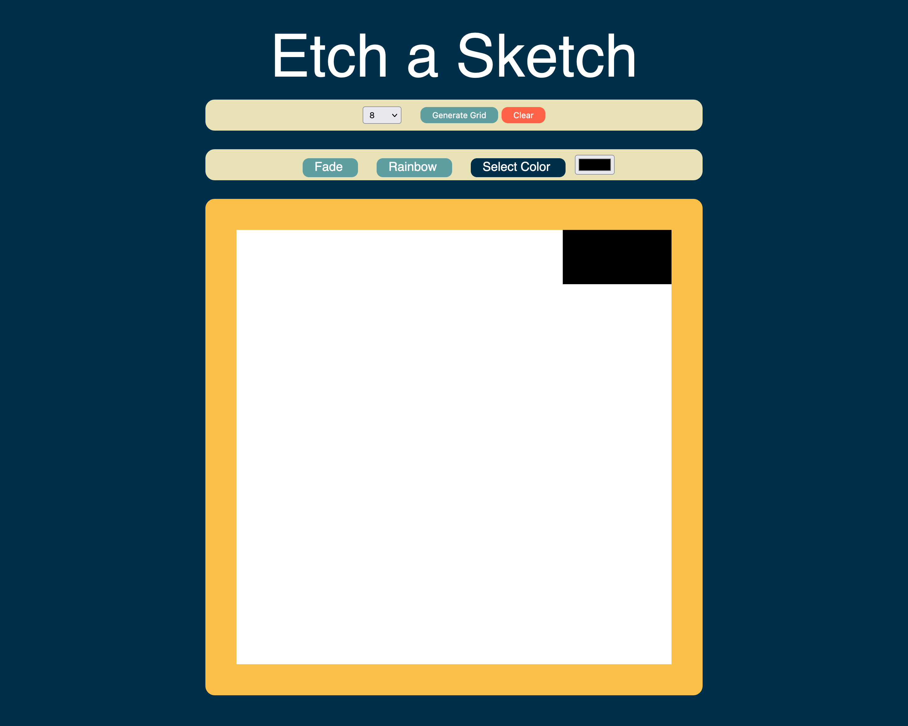

# EtchASketch

### The challenge

From The Odin Project - Users should be able to:

- Change Grid Size
- Hover mouse over grid to change colors
- Use different color options to change how the colors change

### Screenshot

### Links
- Live Site URL: [Here](https://jolly-kilby-c6282c.netlify.app/)

### Built with

- HTML5
- CSS
- Flexbox
- Mobile-first workflow
- Vanilla Javascript
